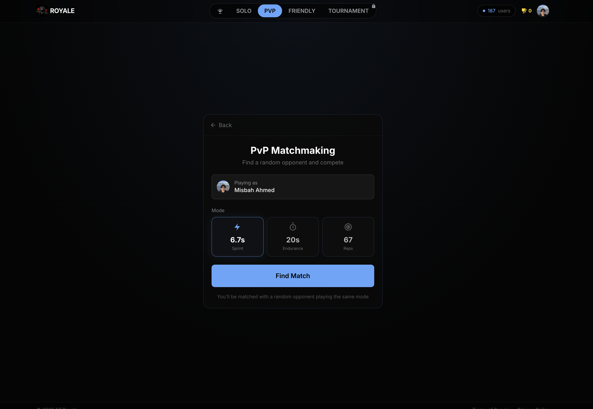
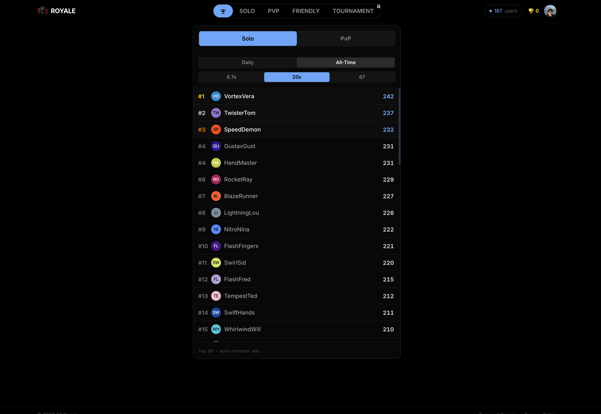
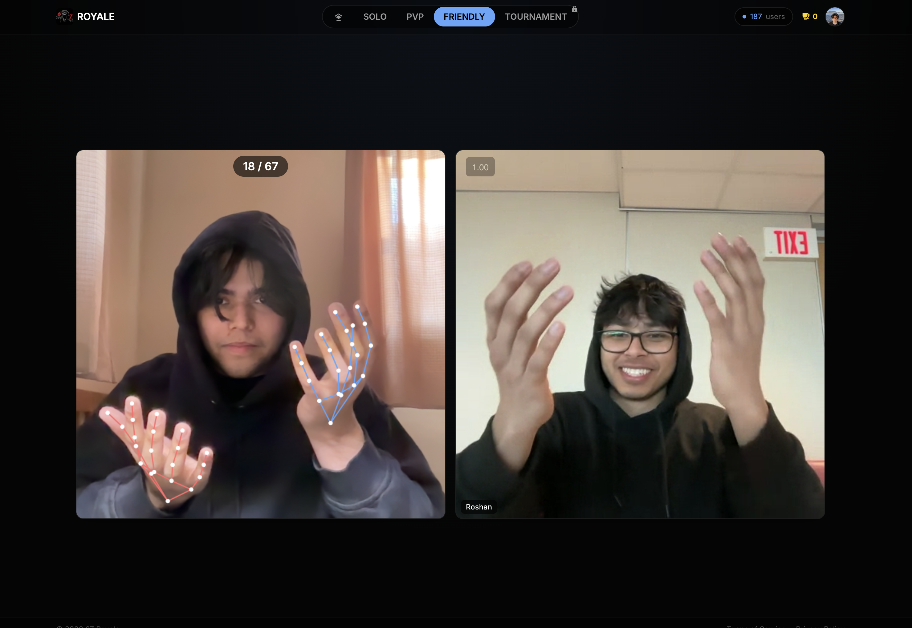
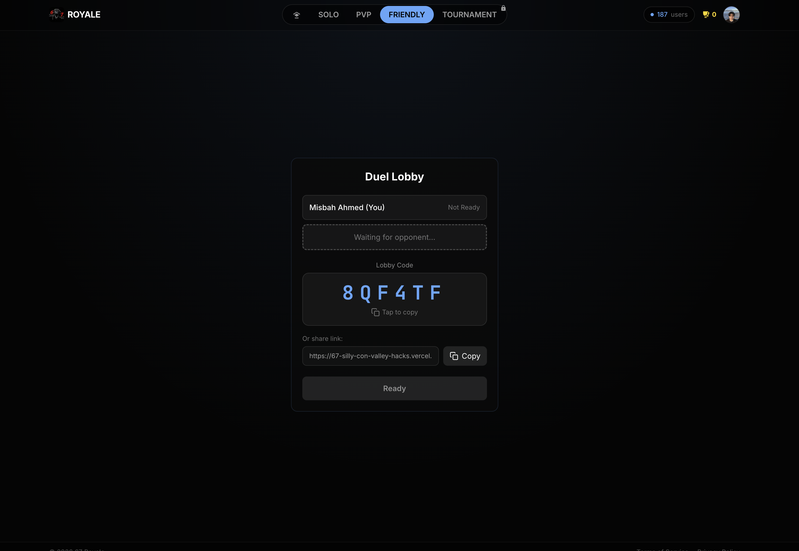
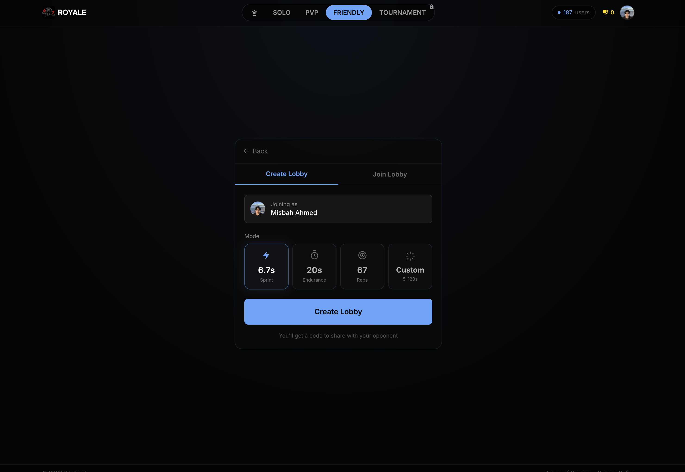

# 67 Royale

A competitive, real-time hand motion tracking game built with computer vision. Players compete to complete 67 hand alternations as fast as possible, or rack up the highest rep count within timed challenges.

Built for SillyCon Valley Hacks, inspired by the viral TikTok "6-7 brainrot" trend.

## Screenshots

| Landing Page | Solo Gameplay | Leaderboard |
|:---:|:---:|:---:|
|  |  |  |

| PvP 1v1 | Create Lobby | Lobby |
|:---:|:---:|:---:|
|  |  |  |

## Overview

67 Royale uses MediaPipe Hands to track hand movements through your webcam in real-time. The game detects when you alternate raising your left and right hands, counting each successful rep while enforcing anti-cheat measures to ensure legitimate gameplay.

### Game Modes

**Solo Mode**
- Three ranked challenges: 6.7 seconds, 20 seconds, or 67 reps
- Compete for global leaderboard positions
- Track your daily and all-time rankings
- Custom duration practice mode (5-120 seconds, not ranked)

**PvP Mode**
- Quick matchmaking for 1v1 competitive matches
- Real-time competitive gameplay
- Ranked matches with ELO-based matchmaking
- Side-by-side WebRTC video feeds

**Friendly Lobby**
- Create private lobbies with 6-digit shareable codes
- Invite friends for casual 1v1 matches
- Custom duration selection (5-120 seconds)
- No ranking impact, just for fun

**Tournament Mode** (Coming Soon)
- Bracket-style elimination tournaments
- Scheduled competitive events
- Prize pools and leaderboards
- Multiple tournament formats

## Technical Stack

### Frontend
- Next.js 16 (App Router)
- TypeScript 5
- Tailwind CSS 4
- React 19 with performance-optimized refs

### Computer Vision
- MediaPipe Hands for 21-point hand landmark tracking
- Custom velocity-based alternation detection algorithm
- Real-time processing at 30+ fps
- Calibration system for baseline position tracking

### Backend & Infrastructure
- Firebase Firestore for real-time data storage
- WebRTC peer-to-peer video connections with TURN relay support
- Next.js API routes with JWT session validation
- Custom rate limiting and profanity filtering
- Vercel deployment

## How It Works

### Calibration
When you start a game, you hold both hands level at hip height for 3 seconds. The system establishes a baseline Y-position and validates that your hands are properly aligned before gameplay begins.

### Rep Detection Algorithm

The detection system uses several layers of validation:

1. **Palm Position Tracking**: Averages wrist and middle finger MCP landmarks for stable position calculation
2. **Vertical Separation**: Hands must be at least 0.06 normalized units apart vertically
3. **Velocity Requirements**: Both hands must be actively moving (minimum velocity: 0.008 per frame)
4. **Opposite Motion Detection**: Hands must move in opposite directions to prevent cheating
5. **State Flip Counting**: Reps only increment when transitioning between left-up and right-up states

### Anti-Cheat Measures

- Opposite motion requirement prevents static hand wiggling
- Minimum velocity threshold blocks micro-movements
- Exponential smoothing (factor: 0.4) eliminates tracking noise
- Calibration baseline prevents position gaming
- Session-based JWT tokens prevent score replay attacks
- Server-side validation with rate limiting (1 submission per 10 seconds)

## Project Structure

```
67-SillyCon-Valley-Hacks/
├── frontend/                       # Main Next.js application
│   ├── src/
│   │   ├── app/                    # Next.js App Router pages
│   │   │   ├── api/                # REST API endpoints
│   │   │   ├── duel/               # Friendly lobby pages
│   │   │   ├── pvp/                # PvP matchmaking pages
│   │   │   ├── tournament/         # Tournament pages
│   │   │   ├── leaderboard/        # Leaderboard pages
│   │   │   └── score/              # Score sharing pages
│   │   ├── components/
│   │   │   ├── game/               # Core game UI components
│   │   │   ├── leaderboard/        # Ranking tables
│   │   │   └── ui/                 # Shared UI primitives
│   │   ├── lib/
│   │   │   ├── hand-tracking.ts    # MediaPipe adapter
│   │   │   ├── brainrot-detector.ts # CV detection algorithm
│   │   │   ├── calibration-tracker.ts # Calibration manager
│   │   │   ├── jwt.ts              # Token validation
│   │   │   └── firebase/           # Firestore SDK
│   │   ├── hooks/
│   │   │   └── useWebRTC.ts        # WebRTC P2P video
│   │   └── types/
│   │       ├── database.ts         # Database types
│   │       └── game.ts             # Game types
│   └── public/                     # Static assets
├── docs/                           # Project documentation
├── firebase.json                   # Firebase config
├── firestore.rules                 # Security rules
├── vercel.json                     # Deployment config
├── CLAUDE.md                       # AI assistant instructions
└── README.md                       # This file
```

## Database Schema

### Collections

**scores** - Global leaderboard entries (Solo mode)
- Fields: `username`, `score`, `duration_ms`, `created_at`, `uid`
- Indexes: Composite on `(duration_ms, score, created_at)` for ranking queries

**duels** - Friendly lobby sessions
- Fields: `duration_ms`, `status`, `lobby_code`, `start_at`, `expires_at`
- Includes WebRTC signaling subcollections (`webrtc/`, `hostCandidates/`, `guestCandidates/`)

**duel_players** - Friendly lobby participants
- Fields: `duel_id`, `player_key`, `username`, `ready`, `score`, `submitted_at`

**pvp_matches** - Ranked PvP matches
- Fields: `status`, `player1_uid`, `player2_uid`, `winner_uid`, `start_at`, `duration_ms`

**user_stats** - Player statistics and ELO ratings
- Fields: `uid`, `username`, `elo_rating`, `trophies`, `total_matches`, `wins`, `losses`

## Getting Started

### Prerequisites
- Node.js 18 or later
- Firebase project with Firestore enabled
- (Optional) TURN server credentials for WebRTC on restrictive networks

### Installation

1. Clone the repository
```bash
git clone https://github.com/yourusername/67-SillyCon-Valley-Hacks.git
cd 67-SillyCon-Valley-Hacks/frontend
```

2. Install dependencies
```bash
npm install
```

3. Set up environment variables

Create `frontend/.env.local` with the following:

```env
# Firebase Configuration
NEXT_PUBLIC_FIREBASE_API_KEY=your_api_key
NEXT_PUBLIC_FIREBASE_AUTH_DOMAIN=your_auth_domain
NEXT_PUBLIC_FIREBASE_PROJECT_ID=your_project_id
NEXT_PUBLIC_FIREBASE_STORAGE_BUCKET=your_storage_bucket
NEXT_PUBLIC_FIREBASE_MESSAGING_SENDER_ID=your_sender_id
NEXT_PUBLIC_FIREBASE_APP_ID=your_app_id

# Firebase Admin (server-side)
FIREBASE_SERVICE_ACCOUNT_KEY=base64_encoded_service_account_json

# Security
JWT_SECRET=random_32_character_secret

# App URL
NEXT_PUBLIC_APP_URL=http://localhost:3000

# TURN Server (optional but recommended for WebRTC)
NEXT_PUBLIC_TURN_URL=turn:relay.metered.ca:80
NEXT_PUBLIC_TURN_USERNAME=your_metered_api_key
NEXT_PUBLIC_TURN_CREDENTIAL=your_metered_api_key
```

4. Deploy Firestore security rules
- Open Firebase Console > Firestore Database > Rules
- Copy contents of `firestore.rules` and publish

5. Create Firestore indexes
- Run the app and check console for index creation URLs
- Click each URL to create required composite indexes

6. Run the development server
```bash
npm run dev
```

Open [http://localhost:3000](http://localhost:3000) to start playing.

### Production Deployment

The app is designed for Vercel deployment:

1. Push to GitHub
2. Import repository in Vercel
3. Add environment variables from `.env.local`
4. Deploy

Note: HTTPS is required for camera access in production.

## Browser Compatibility

- Chrome/Edge 80+
- Safari 14+
- Firefox 78+
- Mobile Safari (iOS 14+)
- Chrome Mobile (Android 8+)

Camera permissions are required on first visit.

## Performance Considerations

- Target frame rate: 30 fps minimum
- WebGL backend preferred for TensorFlow.js operations
- MediaPipe models loaded from CDN (initial load ~500ms)
- Square aspect ratio (640x640) for consistent tracking
- State management uses refs to prevent re-render overhead during gameplay

## Known Limitations

1. MediaPipe models require CDN load on first visit
2. Duel lobby state updates via polling (2-second interval)
3. WebRTC requires TURN relay servers for most non-localhost networks
4. Custom duration games don't appear on global leaderboard
5. Firestore composite indexes must be manually created on first deployment

## Security

- Server-side JWT validation for all score submissions
- Rate limiting: 1 submission per 10 seconds per IP
- Profanity filtering on usernames
- Input validation on all API endpoints
- Firebase Admin SDK used exclusively server-side
- Client-side Firestore access limited to read-only operations

## Contributing

This project was built for SillyCon Valley Hacks. Feel free to fork and extend with additional features or optimizations.

## License

MIT License - feel free to use this project for learning or building your own versions.